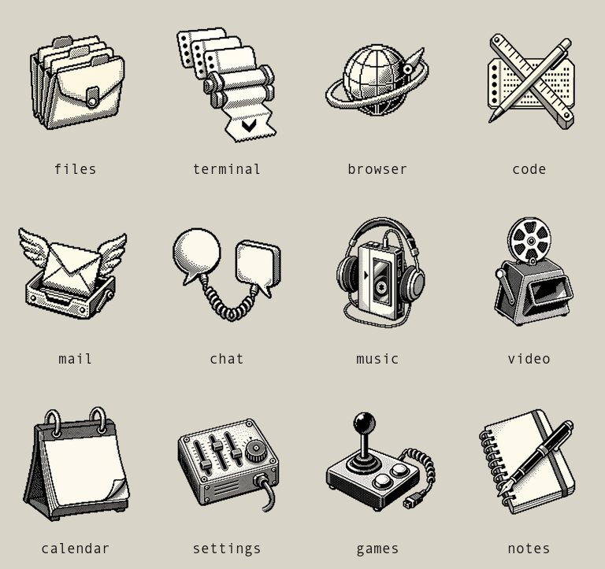

# One-Bit Bureau

One-Bit Bureau is one installable Omarchy experience: real desktop files, a bottom application dock, a searchable window overview, active-application context in the top bar, a native theme, original bitmap branding, a bundled app-icon pack, and two legally redistributable retro monospace fonts.

It borrows the original Macintosh interface method rather than Apple artwork or exact trade dress. Select the object before acting, keep spatial landmarks stable, show immediate feedback, leave unavailable commands discoverable, and make the safe action obvious. The visual system uses original raster artwork, opaque paper-and-carbon surfaces, square geometry, and a two-color illustrated workbench.



The product identity is consistent throughout: repository `RegionallyFamous/one-bit-bureau`, plugin ID `io.github.regionallyfamous.one-bit-bureau`, and namespaced runtime state under `~/.config/omarchy/one-bit-bureau/`.

## What is included

- Real files and folders from the configured XDG Desktop directory on every display, with selection, keyboard opening, drag/drop, Trash, safe launcher confirmation, persistent positions, and original bitmap object icons. Safe local PNG, JPEG, WebP, and BMP files up to 32 MiB render as grayscale desktop thumbnails without modifying the source file; opening the file still shows the original color image. SVG, animated, oversized, inaccessible, or otherwise unsupported images use the authored one-bit picture fallback.
- A bottom dock with launch/focus, running indicators, auto-hide, pinning, reordering, previews, one-output ownership, and an optional app-switcher HUD. A fresh install starts with Files, Chromium, and Foot, and the bundled art is optically cropped and centered inside consistent 48px icon boxes.
- Twelve original offline One-Bit Bureau app-role icons, automatic matching for common Linux desktop IDs, grayscale native fallbacks for unmatched apps, manual association, and an explicit full-color native-icon override.
- A searchable, keyboard-navigable contact-sheet overview with live window previews and a top-left hot corner.
- A native bar widget placed beside the Omarchy menu; One-Bit Bureau leaves the rest of Omarchy’s top bar intact.
- The `one-bit-bureau` theme with a 4K Bitmap Workbench background, opaque square shell surfaces, and a branded unlock mark plus honest 1920×1080 unlock preview.
- Original About and screensaver text branding generated through Omarchy’s own image-to-text pipeline.
- Monaspace Krypton NF 1.400 and Departure Mono 1.500, with exact upstream licenses and SHA-256 checksums under `fonts/`. Setup makes both families available to fontconfig but deliberately leaves the selected Omarchy font unchanged.

The product contract and provenance guardrails live in [docs/DIRECTION.md](docs/DIRECTION.md). Imported-code and font provenance lives in [THIRD_PARTY_NOTICES.md](THIRD_PARTY_NOTICES.md).

## Install: one memorable address

The short installer lives at the first-party, memorable `bureau.regionallyfamous.com` address:

```bash
bash <(curl -fsSL https://bureau.regionallyfamous.com/install)
```

The served bootstrap is the small, public [`shortlink/src/install.sh`](shortlink/src/install.sh) file in this repository. It calls Omarchy’s own validated Git plugin flow, then runs the matching setup from that checkout; it does not bypass the existing trust prompt. Inspect the exact response before running it with `curl -fsSL https://bureau.regionallyfamous.com/install`.

For an audit-first install with no fetched bootstrap, use the complete commands directly:

```bash
omarchy plugin add https://github.com/RegionallyFamous/one-bit-bureau.git --yes && bash "$HOME/.config/omarchy/plugins/io.github.regionallyfamous.one-bit-bureau/setup" --adopt-plugin
```

Both paths keep the source auditable in a normal Git checkout and use Omarchy’s manifest validator before any One-Bit Bureau code runs. The first command leaves the validated plugin disabled; setup then presents one explicit unsandboxed-plugin warning and lists the system changes before it enables anything. Declining removes that disabled checkout. After independently reviewing the repository, a noninteractive install may append `--yes` to the quick command or the setup command. Setup also verifies the canonical repository identity and commit, refuses enabled standalone replacements, records exact ownership, and rolls back a partial transaction.

One-Bit Bureau targets the current Omarchy Quattro plugin API and relies on Omarchy’s default runtime tools (`python3` with Gio bindings, `hyprctl`, `jq`, Git, coreutils, and fontconfig). Disable `henri.desktop-icons`, `crmne.active-window`, `expose.window-overview`, and `rosakodu.dock` first; setup refuses an enabled conflict instead of silently doubling shell surfaces.

For development from this checkout:

```bash
bash setup --local
```

## What setup changes

- Installs and enables `io.github.regionallyfamous.one-bit-bureau` with its native bar widget in the left section after `omarchy.menu`.
- Installs `one-bit-bureau` through Omarchy’s theme-source ownership system when the host provides it. On earlier Quattro builds, setup creates one verified symlink to the theme inside the canonical plugin checkout, keeping plugin and theme on the same commit without a second updater. It then puts the bar at the top, makes it opaque, and applies the theme.
- Installs both bundled fonts under `~/.local/share/fonts/one-bit-bureau/` and refreshes fontconfig, without selecting a font or rewriting terminal configuration.
- Backs up and applies One-Bit Bureau About/screensaver branding. Removal restores the exact prior bytes only while One-Bit Bureau still owns the active files; a later user edit is preserved.
- Installs the `one-bit-bureau` coordinator into `~/.local/bin/` and creates the already-configured XDG Desktop directory when needed. It does not rewrite `XDG_DESKTOP_DIR`, Hyprland bindings, or input policy.
- Ships unlock branding inside the theme but does not run privileged Plymouth/initramfs commands. Choose it through Omarchy’s Style → Unlock surface when desired.

## The One-Bit Bureau command

```bash
one-bit-bureau status
one-bit-bureau update
one-bit-bureau remove
one-bit-bureau overview
one-bit-bureau motion reduce
one-bit-bureau motion full
one-bit-bureau motion status
one-bit-bureau icon pack list
one-bit-bureau icon pack set org.gnome.Nautilus files
one-bit-bureau icon native firefox
one-bit-bureau icon auto firefox
one-bit-bureau font list
one-bit-bureau font use krypton
```

`one-bit-bureau update` updates only this Git-managed plugin and its recorded theme installation, verifies that both resolve to the same commit, and reapplies the theme only when it was already active. `one-bit-bureau motion reduce` stores the native `reducedMotion` bar setting used across One-Bit Bureau surfaces; `one-bit-bureau motion full` restores the brief default transitions, and `one-bit-bureau motion status` reports the current mode. `one-bit-bureau font use krypton` delegates to Omarchy’s supported font setter; Krypton is the recommended whole-desktop choice because it includes Nerd Font symbols. Departure Mono is the more aggressively pixel-shaped alternate and does not include those symbols.

## Omarchy navigation remains Omarchy navigation

One-Bit Bureau adds mouse-friendly discovery without replacing Omarchy’s keyboard-first model. Focused One-Bit Bureau surfaces explicitly pass every `Super`-modified chord through to the compositor, so the native tiling, workspace, grouping, popped-window, fullscreen, and scratchpad commands remain authoritative.

| Intent | Control |
|---|---|
| Omarchy menu | `Super + Space` |
| Terminal / browser | `Super + Return` / `Super + Shift + Return` |
| Move focus / swap windows | `Super + Arrow` / `Super + Shift + Arrow` |
| Toggle stack, float, fullscreen | `Super + J`, `Super + T`, `Super + F` |
| Toggle workspace layout / group / popped window | `Super + L`, `Super + G`, `Super + O` |
| Scratchpad | `Super + Grave` or `Super + S` |
| Select / open a desktop object | Single click; then `Return`, or double-click |
| Show all windows | Top-left hot corner or `one-bit-bureau overview` |
| Preview a selected overview window | `Space` |
| Change background | `Super + Ctrl + Space` |

One-Bit Bureau does not replace global Alt+Tab. An optional One-Bit Bureau HUD can live on the non-conflicting `Alt + Grave` chord by adding this user-owned snippet to `~/.config/hypr/bindings.lua`:

```lua
o.bind("ALT + GRAVE", "One-Bit Bureau app switcher next", "omarchy-shell -q regionallyfamous.one-bit-bureau.dock altTabNext")
o.bind("ALT + SHIFT + GRAVE", "One-Bit Bureau app switcher previous", "omarchy-shell -q regionallyfamous.one-bit-bureau.dock altTabPrev")
```

An optional overview binding can use `Ctrl + Up` without taking a `Super` chord:

```lua
o.bind("CTRL + UP", "One-Bit Bureau window overview", hl.dsp.event("regionallyfamous.one-bit-bureau.overview:toggle"))
```

## Official Omarchy contracts covered

One-Bit Bureau follows the documented native boundaries for [themes](https://omarchy.org/manual/themes/), [backgrounds](https://omarchy.org/manual/backgrounds/), [branding](https://omarchy.org/manual/branding/), [fonts](https://omarchy.org/manual/fonts/), [the top bar](https://omarchy.org/manual/the-top-bar/), and [navigation](https://omarchy.org/manual/navigation/). Theme colors drive Omarchy’s normal app and shell templates; backgrounds remain selectable; unlock assets use the documented filenames; the bar widget uses native placement and `shell.json`; fonts remain fontconfig/Omarchy-managed; and One-Bit Bureau does not seize the system’s navigation language.

## Network and permissions

The plugin runs with the current user’s shell privileges. It reads the configured Desktop directory, writes user state only under `~/.config/omarchy/one-bit-bureau/`, launches selected files through Gio, and calls standard Omarchy/Hyprland helpers. Copied `.desktop` launchers remain untrusted unless they came from canonical application directories; trusting one requires explicit confirmation.

The bundled app-icon pack and automatic associations work entirely offline. A common app receives the matching authored One-Bit role; an unmatched app keeps its recognizable native shape but is rendered in grayscale across the dock, drag ghost, preview fallback, app switcher, and icon manager. Manage Icons can assign any of the twelve roles, accept a custom file, or use Native to restore the application's original full-color icon. One-Bit Bureau does not send app names to an icon service or download third-party artwork.

## Known boundaries

- The dock owns one persisted output. Set it with `one-bit-bureau dock setScreen DP-1`; if that output disconnects, One-Bit Bureau falls back safely and returns when it reconnects.
- Linux client-side decorations remain application-owned, so no shell plugin can make every title bar match.
- The dock is a modern launcher translated into One-Bit Bureau’s object-first system, not a claim of historical 1984 behavior.
- PNGs under `docs/` are labeled static design proofs. Public runtime claims remain gated on the disposable x86_64 Omarchy acceptance run and captures from the exact release artifact.

## Validate

```bash
npm --prefix shortlink ci
npm --prefix shortlink test
rm -rf shortlink/node_modules
bash tests/static.sh
```

The Worker gate runs first because the generated dependency tree contains executable tooling and therefore must not remain inside a repository that is also a safe Omarchy theme source. The plugin/theme gate covers manifest and source safety, helper syntax, desktop trust/path policy, dock lifecycle and app association, setup/uninstall rollback, branding/font ownership, canonical identity regression checks, the shell bootstrap, strict theme validation, headless template rendering, and navigation pass-through contracts. The graphical gate is `bash test/omarchy-acceptance.sh` inside the disposable x86_64 Omarchy guest.

## Remove

```bash
one-bit-bureau remove
```

Removal is ownership-aware. It validates the owned plugin and theme before changing anything, restores prior theme, bar, and branding state only while One-Bit Bureau still owns the active value, then removes either the recorded theme-source child or the exact plugin-linked theme selected at install time. It removes unmodified bundled fonts and command, preserves modified ones, and keeps Desktop files, pins, icon choices, custom icons, and desktop positions.
