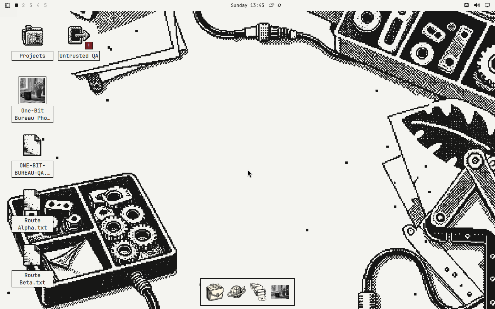
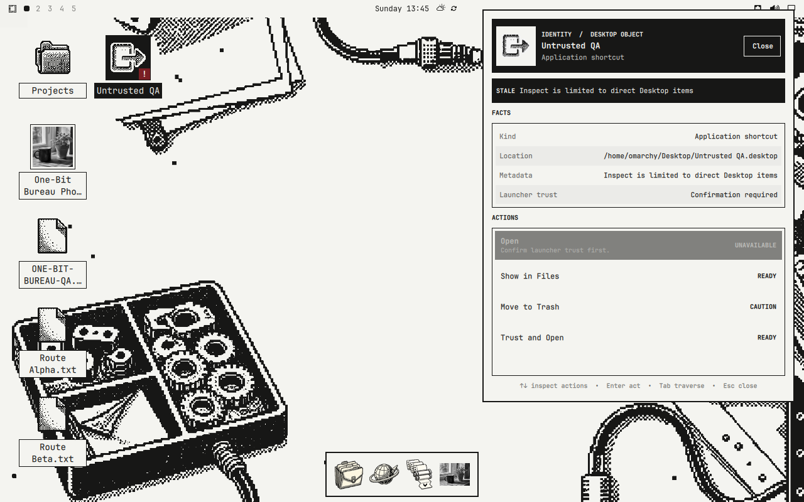
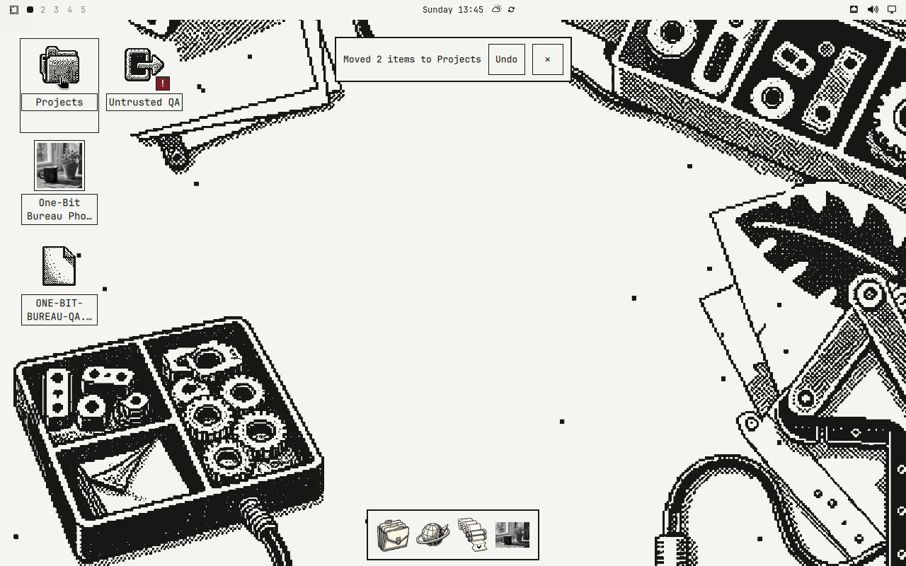
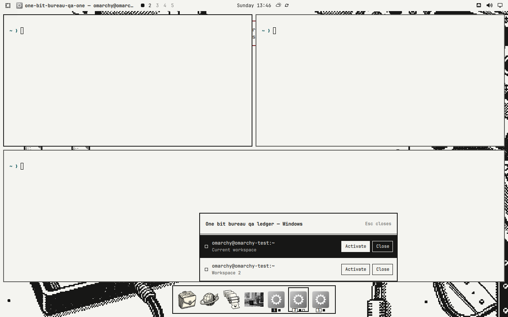
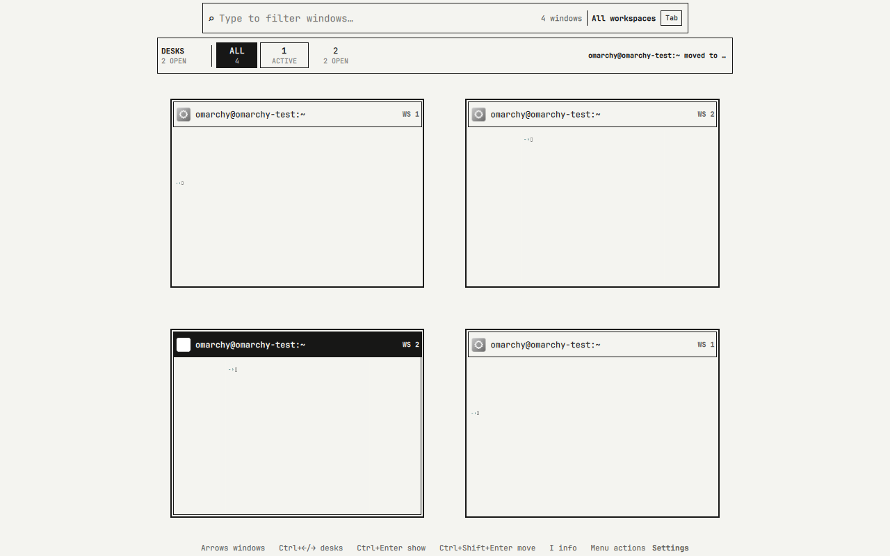
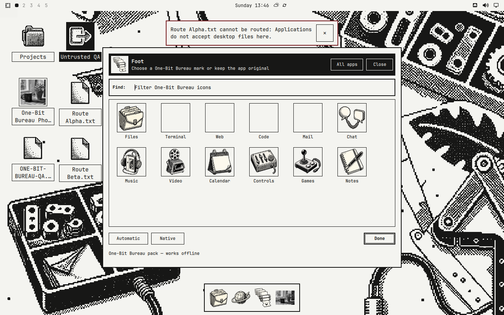
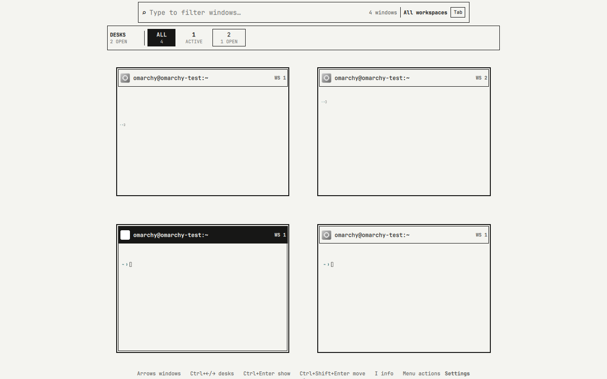
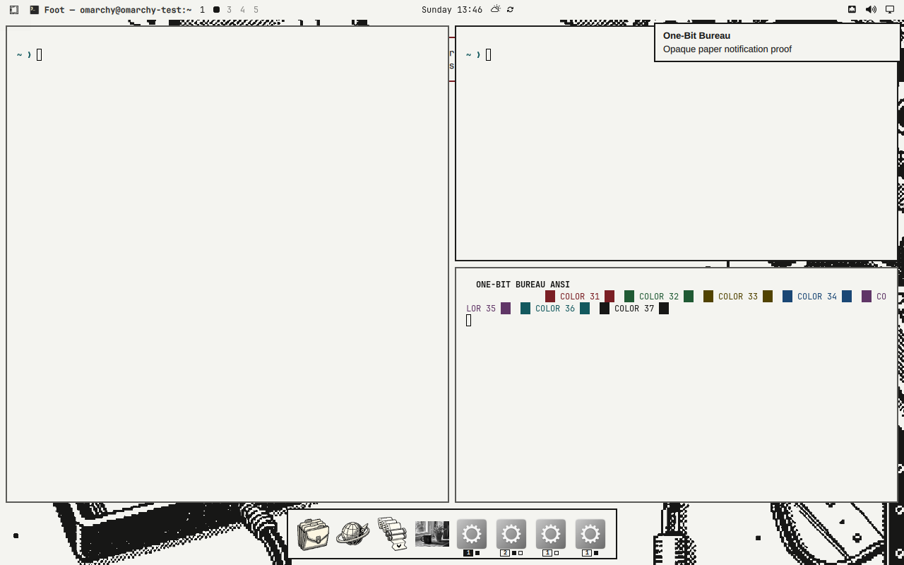

# One-Bit Bureau

**One command turns Omarchy into a one-bit Macintosh-inspired workbench.**

You get real folders on the desktop, a bottom dock, one shared Inspector, safe file routing with Undo, a window ledger, a workspace board, original bitmap icons, a matching whole-desktop theme, retro fonts, and One-Bit Bureau branding—all installed and updated together.

[Install](#install) · [See everything it includes](#what-you-get) · [Read the Wiki](https://github.com/RegionallyFamous/one-bit-bureau/wiki) · [Latest release](https://github.com/RegionallyFamous/one-bit-bureau/releases/latest)



## Install

One-Bit Bureau requires a current Omarchy Quattro installation.

```bash
bash <(curl -fsSL https://bureau.regionallyfamous.com/install)
```

The installer fetches the plugin through Omarchy’s normal Git validation, tells you exactly what it will change, and asks before activating unsandboxed plugin code.

Want to inspect it first?

```bash
curl -fsSL https://bureau.regionallyfamous.com/install
```

The complete manual install and trust model are documented in the [installation guide](https://github.com/RegionallyFamous/one-bit-bureau/wiki/Installation-and-Trust).

## What you get

- **A real desktop.** Files and folders come from your configured Desktop directory. Select up to 64 items with Shift or Control, route them into folders or Trash, see the exact verb before release, and Undo unchanged regular-file moves from the receipt.
- **One shared Inspector.** Press Control+I on a desktop object, choose **Get Info** for a dock app, or press I on an overview window. Identity, facts, and actions stay in the same predictable places.
- **A bottom dock with a Window Ledger.** Launch apps, focus the most-recent surviving window, see 1/2/3+ window state, inspect current and other-workspace counts, open a titled window list, pin and reorder favorites, preview windows, and optionally auto-hide it.
- **A window overview and workspace board.** Move the pointer to the top-left corner or run `one-bit-bureau overview` to search and switch. The compact rail shows occupancy and moves the selected window to an existing ordinary workspace without closing the overview.
- **A complete visual system.** The Bitmap Workbench wallpaper, square paper-and-carbon surfaces, top-bar app context, notification styling, terminal palette, branding, and unlock art all belong together.
- **Twelve original app icons.** Files, Terminal, Web, Code, Mail, Chat, Music, Video, Calendar, Controls, Games, and Notes work offline.
- **Sensible fallbacks.** Apps without a matching One-Bit icon keep their recognizable native icon in grayscale. You can restore the original color icon at any time.
- **Two optional retro fonts.** Monaspace Krypton NF is the practical whole-desktop choice; Departure Mono is the sharper pixel-shaped alternative.
- **A reversible install.** One-Bit Bureau records what it owns, restores the settings and branding it replaced, and leaves your Desktop files and personal choices alone.

## Your first five minutes

| Try this | What happens |
|---|---|
| Single-click a desktop object | Selects it without opening it |
| Control-click or Shift-click objects | Builds a bounded multi-selection |
| Drag selected files onto a desktop folder | Shows the exact Move route, then a result receipt with Undo when reversal is provable |
| Press Control+I | Opens the selected desktop object's Inspector |
| Double-click it or press Return | Opens the selected file or folder |
| Choose Get Info on a dock icon | Opens application facts and actions; Show Windows opens its Window Ledger |
| Move to the top-left corner | Opens the searchable window overview |
| In Overview, use Control+Left/Right then Control+Shift+Enter | Chooses a workspace and moves the selected window there |
| Run `one-bit-bureau motion reduce` | Removes nonessential One-Bit Bureau motion |
| Run `one-bit-bureau font use krypton` | Selects the bundled Nerd Font-compatible retro font |

The [everyday-use guide](https://github.com/RegionallyFamous/one-bit-bureau/wiki/Everyday-Use) covers keyboard controls, dock placement, optional app switching, fonts, motion, and icon management.

## See how it works

<table>
  <tr>
    <td width="50%"><br><sub>One shared Inspector for desktop objects, applications, and windows</sub></td>
    <td width="50%"><br><sub>A local result receipt offers Undo only when reversal is proven</sub></td>
  </tr>
  <tr>
    <td width="50%"><br><sub>One app identity with a truthful titled-window ledger</sub></td>
    <td width="50%"><br><sub>A stable workspace board that moves the exact selected window and stays open</sub></td>
  </tr>
</table>

These are real 1280×800 captures retained from passed disposable x86_64 Omarchy run `9d36kxlcrt`, using Omarchy commit `2c593dbb` and public runtime commit `4af531c`. That run produced 37 review frames and passed the exact public install, activate, update, remove, rollback, and user-data-preservation lifecycle. The later documentation commit only packages these unchanged evidence pixels and copy.

### The rest of the system

<table>
  <tr>
    <td width="50%"><br><sub>Twelve offline icons plus automatic grayscale and native fallbacks</sub></td>
    <td width="50%"><br><sub>Searchable, keyboard-navigable windows and workspaces</sub></td>
  </tr>
  <tr>
    <td colspan="2"><br><sub>Whole-desktop theme across terminals, notifications, top bar, dock, and wallpaper</sub></td>
  </tr>
</table>

## Make it yours

```bash
one-bit-bureau icon pack list
one-bit-bureau font list
one-bit-bureau font use krypton
one-bit-bureau motion reduce
one-bit-bureau motion full
```

The dock’s **Manage Icons** screen is the easiest way to assign a One-Bit role, keep an automatic grayscale fallback, use an app’s original full-color icon, or choose your own local image.

## Update or remove

```bash
one-bit-bureau update
one-bit-bureau remove
```

Removal restores the theme, top-bar position, transparency, and branding that One-Bit Bureau still owns. It keeps your Desktop files, dock pins, icon choices, custom icons, and saved positions.

## Honest limits

- This is an original Macintosh-inspired interface, not Apple artwork or a pixel-perfect copy of System 1.
- The dock is a useful modern launcher translated into the One-Bit Bureau style.
- Linux applications own their client-side title bars, so one plugin cannot make every app window identical.
- Wayland does not make a manual desktop-icon drag portable across separate layer-shell windows, so desktop-to-dock internal dragging is not advertised. Native external file drops and the desktop, Trash, and overview routes are supported.
- One-Bit Bureau keeps Omarchy’s tiling, launcher, Quick Look, notifications, controls, and normal `Super` navigation intact.
- Setup refuses to run beside enabled standalone desktop-icon, dock, overview, or active-window plugins that would duplicate the same surfaces.

## Help and technical details

The [Wiki](https://github.com/RegionallyFamous/one-bit-bureau/wiki) contains the detailed command reference, installation and trust model, app-icon rules, architecture, state files, theme and font provenance, development workflow, test gates, and troubleshooting.

- [Everyday use](https://github.com/RegionallyFamous/one-bit-bureau/wiki/Everyday-Use)
- [Icons and app associations](https://github.com/RegionallyFamous/one-bit-bureau/wiki/Icons-and-App-Associations)
- [Troubleshooting](https://github.com/RegionallyFamous/one-bit-bureau/wiki/Troubleshooting)
- [Architecture and state](https://github.com/RegionallyFamous/one-bit-bureau/wiki/Architecture-and-State)
- [Development and testing](https://github.com/RegionallyFamous/one-bit-bureau/wiki/Development-and-Testing)
- [Source-backed 1.2 research backlog](docs/ONE-BIT-BUREAU-1.2-RESEARCH-BACKLOG.md)

One-Bit Bureau is MIT-licensed. Imported-code and font notices are preserved in [THIRD_PARTY_NOTICES.md](THIRD_PARTY_NOTICES.md).
