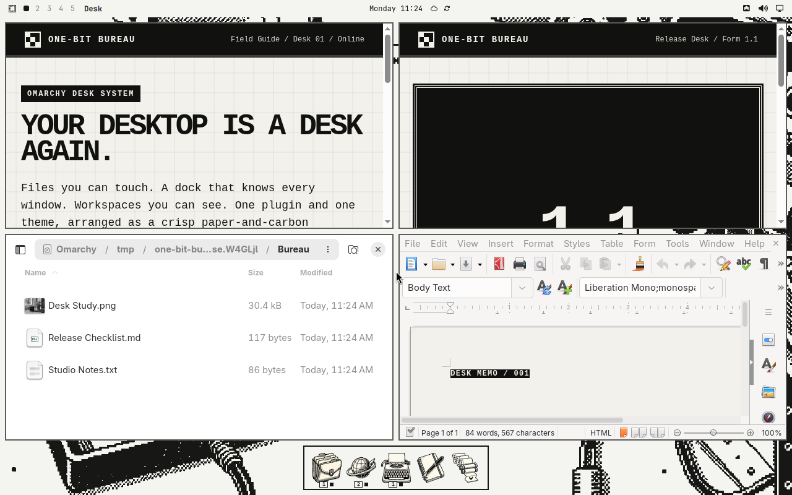

# One-Bit Bureau

**Turn Omarchy into a one-bit Macintosh-inspired workbench with one command.**

One-Bit Bureau adds a real file desktop, a bottom dock, a shared Inspector, a window overview, original bitmap icons, retro fonts, and a matching black-and-white theme—without replacing Omarchy or Hyprland.

[Install](#install) · [What you get](#what-you-get) · [Everyday use](https://github.com/RegionallyFamous/one-bit-bureau/wiki/Everyday-Use) · [Wiki](https://github.com/RegionallyFamous/one-bit-bureau/wiki)



## Install

One-Bit Bureau is built for a current Omarchy Quattro installation.

```bash
bash <(curl -fsSL https://bureau.regionallyfamous.com/install)
```

The installer adds and activates the plugin, theme, fonts, and One-Bit Bureau branding together. It keeps Omarchy's shell, tiling, launcher, controls, notifications, Quick Look, and normal `Super` navigation.

If you already use another desktop-icons, dock, overview, or active-window plugin, disable it first so the two interfaces do not overlap. See [Installation and Trust](https://github.com/RegionallyFamous/one-bit-bureau/wiki/Installation-and-Trust) before installing if you want the full compatibility and security details.

## What you get

- **A real desktop.** Open, select, rename, arrange, preview, move, copy, Trash, and undo changes to files in your configured Desktop folder.
- **Trash and connected drives.** Their actual state and available actions appear on the desktop. If your XDG Desktop is disabled, One-Bit Bureau tells you instead of silently creating a new folder.
- **A Macintosh-inspired dock.** Launch apps, switch between their windows, pin favorites, reorder icons, preview windows, and turn on auto-hide.
- **One shared Inspector.** Use the same Get Info surface for desktop objects, applications, and windows.
- **A searchable window overview.** Find windows, switch workspaces, and move the selected window to another ordinary workspace on the same monitor.
- **A complete one-bit look.** Two original wallpapers, matching shell surfaces, notifications, terminal colors, unlock art, branding, and 32 original app icons.
- **Useful icon fallbacks.** Apps without a custom One-Bit icon keep a recognizable grayscale native icon; unresolved apps get the bundled Application mark instead of a blank square.
- **Two bundled fonts.** Choose practical Monaspace Krypton NF or the sharper Departure Mono.
- **A reversible install.** Removal restores the settings and branding One-Bit Bureau replaced while leaving your Desktop files and personal dock, icon, and layout choices alone.

## See it in action

<table>
  <tr>
    <td colspan="2"><br><sub>A calm, useful desktop—not a staged pile of junk files</sub></td>
  </tr>
  <tr>
    <td width="50%"><br><sub>Get Info in the shared Inspector</sub></td>
    <td width="50%"><br><sub>Clear file-operation results with Undo when available</sub></td>
  </tr>
  <tr>
    <td width="50%"><br><sub>Every open window for an app in one place</sub></td>
    <td width="50%"><br><sub>Search, switch, and move windows between workspaces</sub></td>
  </tr>
</table>

## Everyday controls

| Action | Result |
|---|---|
| Single-click | Select a desktop object |
| Control-click or Shift-click | Add objects to the selection |
| Double-click or Return | Open the selected item |
| Space | Open the selected file in Quick Look |
| F2 | Rename one selected item |
| Control+I | Open Get Info in the Inspector |
| Control+A | Select every item on the desktop |
| Drag selected files onto a folder | Move them and show a result receipt |
| Open **Desk** in the top bar | Create a folder, arrange, tidy, select all, or undo the latest layout change |
| Move the pointer to the top-left corner | Open the searchable window overview |

The [Everyday Use guide](https://github.com/RegionallyFamous/one-bit-bureau/wiki/Everyday-Use) covers all keyboard controls, dock behavior, window management, and customization.

## Make it yours

```bash
one-bit-bureau icon pack list
one-bit-bureau font list
one-bit-bureau font use krypton
one-bit-bureau motion reduce
one-bit-bureau motion full
one-bit-bureau overview
one-bit-bureau doctor
```

The dock's **Manage Icons** screen can use an automatic One-Bit match, another bundled role, the grayscale native icon, the original color icon, or your own local image. See [Icons and App Associations](https://github.com/RegionallyFamous/one-bit-bureau/wiki/Icons-and-App-Associations).

### Optional GTK3 app chrome

```bash
one-bit-bureau app-chrome preview
one-bit-bureau app-chrome on
one-bit-bureau app-chrome off
```

The preview command explains the change without applying it. Opting in themes GTK3 apps at the user level. It does not alter GTK4/libadwaita apps, Qt apps, browser chrome, LibreOffice profiles, system packages, or `/etc`.

## Update or remove

```bash
one-bit-bureau update
one-bit-bureau remove
```

## Help

- [Troubleshooting](https://github.com/RegionallyFamous/one-bit-bureau/wiki/Troubleshooting)
- [Everyday Use](https://github.com/RegionallyFamous/one-bit-bureau/wiki/Everyday-Use)
- [Icons and App Associations](https://github.com/RegionallyFamous/one-bit-bureau/wiki/Icons-and-App-Associations)
- [Full Wiki](https://github.com/RegionallyFamous/one-bit-bureau/wiki)

One-Bit Bureau is [MIT licensed](LICENSE). Font and imported-code notices are in [THIRD_PARTY_NOTICES.md](THIRD_PARTY_NOTICES.md).
